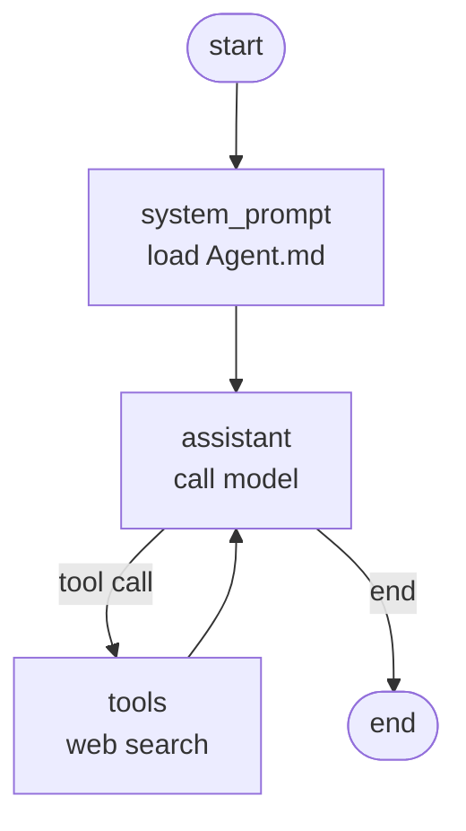

# Shellmate

[🇨🇳 简体中文](README.md) | 🇬🇧 English

[](https://pypi.org/project/shellmate-ai/)
[](https://pypi.org/project/shellmate-ai/)
[](LICENSE)

Shellmate is an AI assistant for your zsh command line. Type a question and press **Ctrl-G** — it answers using your recent command history and any OpenAI-compatible model (OpenAI, DeepSeek, Qwen, …).

## Features

- **Ctrl-G** widget — type a question and press Ctrl-G; **press Ctrl-G on an empty prompt to explain the last command**
- Markdown rendering in the terminal (syntax-highlighted code, tables, lists)
- Automatically captures the last command and its exit code to diagnose failures
- On failure, shows a hint above the prompt; press **Ctrl-X** to re-run the command piped so the agent sees the full error
- Recent command history as context
- OpenAI-compatible protocol — OpenAI / DeepSeek / Qwen / other endpoints
- Editable system prompt (`~/.config/shellmate/Agent.md`) with a default template shipped in the package
- Built-in DuckDuckGo web search, no API key required
- Secret redaction before model and search requests: prefixed keys, high-entropy tokens, `KEY=value`, quoted secrets, webhook URLs, credentials embedded in URLs, and command-line switches such as `curl -u` / `mysql -pXXX`
- Local SQLite conversation memory (checkpoints), no database service

## Install

Requires Python 3.11+.

```sh
pip install shellmate-ai   # or: pip install -e . from a checkout
shellmate-ai init          # creates config + Agent prompt + zsh plugin + .zshrc entry
source ~/.zshrc            # or open a new terminal
```

> **Note**: the installed command is `shellmate-ai` (matching the PyPI package name).

## Usage

In zsh, type a question and press **Ctrl-G**. **Press Ctrl-G on an empty prompt** to explain the last command (with its exit code) and why it failed.

When a command fails (non-zero exit), a hint appears above the prompt: press **Ctrl-X** to re-run the last command as `2>&1 | shellmate-ai explain`, so the agent sees the merged output before explaining (re-running can have side effects, so it is always manual).

> **Note**: Ctrl-X works at any time, not only after a failure, and long output is truncated to the last 20,000 characters. `^X` is also a prefix of the default zsh key sequences (`^X^U` undo, `^Xr` history search, …), so ZLE waits for `KEYTIMEOUT` (0.4 s by default) before triggering the re-run — those longer sequences still work, and you can lower `KEYTIMEOUT` if the delay feels slow.

```sh
shellmate-ai ask "Why did my last command fail?"            # ask directly
shellmate-ai ask                                            # interactive prompt
shellmate-ai ask --history $'ls -la\ngit status' "explain"  # pass history manually
shellmate-ai ask --thread-id my-task "new session"          # pick the session ID

# Feed command output to Shellmate for explanation (pipe mode)
git push origin main 2>&1 | shellmate-ai explain
tail -200 app.log | shellmate-ai explain "why does it keep timing out?"

shellmate-ai explain-last                                 # explain the last command (Ctrl-G on empty prompt)
shellmate-ai config-path                                  # print config path
shellmate-ai history-lines                                # print history size
```

## Configuration

`shellmate-ai init` creates `~/.config/shellmate/config.json` and `Agent.md`. Set your API key there or via environment variables.

`Agent.md` is the system prompt and is meant to be edited: it is seeded from the packaged template `src/shellmate/prompts/Agent.md` (shipped in the wheel/sdist), written only when the file does not exist, so your edits are never overwritten. Changes apply to new sessions.

```json
{
  "llm": { "base_url": "https://api.openai.com/v1", "model": "gpt-4o-mini", "api_key": "", "timeout": 60.0 },
  "shell": { "history_lines": 20 },
  "search": { "endpoint": "https://html.duckduckgo.com/html/" },
  "privacy": { "redact_secrets": true, "redact_high_entropy": true, "custom_patterns": [] }
}
```

Field constraints: `llm.timeout` must be greater than 0 and at most 600 seconds, `shell.history_lines` is 1–500, `search.endpoint` must be an HTTP(S) URL, `privacy.custom_patterns` adds regexes whose matches are replaced with `[REDACTED]`, and disabling `privacy.redact_secrets` also disables high-entropy detection. Unknown fields — including the removed `provider`, `output_file` and `checkpoint` keys — are rejected with the offending field name instead of being ignored.

Environment variables override JSON settings:

| Variable | Overrides |
| --- | --- |
| `OPENAI_API_KEY` / `SHELLMATE_API_KEY` | `llm.api_key` |
| `SHELLMATE_BASE_URL` | `llm.base_url` |
| `SHELLMATE_MODEL` | `llm.model` |
| `SHELLMATE_THREAD_ID` | `thread_id` (conversation ID, default `shellmate-cli-default`) |
| `SHELLMATE_SEARCH_ENDPOINT` | `search.endpoint` |

The CLI also reads `SHELLMATE_SESSION_ID` (the conversation ID when `--thread-id` is absent, set per window by the zsh plugin), plus `SHELLMATE_HISTORY_TEXT`, `SHELLMATE_LAST_COMMAND` and `SHELLMATE_LAST_EXIT` as fallbacks: the current plugin passes that context as arguments, and the variables are kept only for an already-installed older plugin. History falls back to `~/.zsh_history` when `HISTFILE` is unset.

### Runtime files

| Path | Purpose |
| --- | --- |
| `~/.config/shellmate/config.json` | configuration, mode 600 |
| `~/.config/shellmate/Agent.md` | system prompt, mode 600, freely editable |
| `~/.config/shellmate/shellmate.zsh` | zsh plugin, written by `shellmate-ai init`, mode 644 |
| `~/.config/shellmate/data/checkpoints.sqlite` | conversation memory, SQLite, directory mode 700 |
| `~/.zshrc` | `init` appends `source ~/.config/shellmate/shellmate.zsh` once |

## Architecture

The agent is a LangGraph state machine:



- **system_prompt** — on a session's first run, reads the editable `Agent.md` and stores it as the system message (once per session)
- **assistant** — places the system prompt first and redacts only the conversation messages before calling the OpenAI-compatible model
- **tools** — runs the DuckDuckGo web search when the model requests it

## Project layout

```text
src/shellmate/
├── agent.py           # LangGraph agent + SQLite checkpoints
├── cli.py             # CLI entry point
├── config.py          # Pydantic configuration + loads the packaged default prompt
├── context.py         # history formatting
├── privacy.py         # secret redaction
├── zsh_plugin.py      # bundled zsh plugin (loads shellmate.zsh data file)
├── shellmate.zsh      # zsh plugin (Ctrl-G / Ctrl-X / preexec / precmd)
├── prompts/
│   └── Agent.md       # default system prompt template (written by init)
└── tools/
    └── web_search.py  # DuckDuckGo HTML search
```

## License

[MIT](LICENSE)
