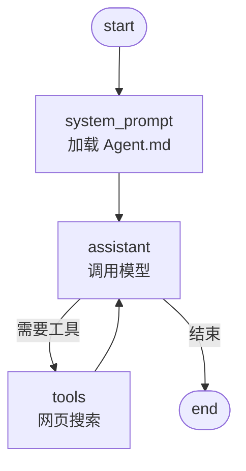

# Shellmate

🇨🇳 简体中文 | [🇬🇧 English](README.en.md)

Shellmate 是一个面向 zsh 的命令行 AI 助手。在命令行输入问题后按 **Ctrl-G**，它会结合近期命令历史，用任意 OpenAI 兼容模型（OpenAI、DeepSeek、Qwen 等）给出回答。

## 功能

- **Ctrl-G** 快捷键 — 先输入问题，再按 Ctrl-G 提交
- 近期命令历史作为上下文
- OpenAI 兼容协议，支持 OpenAI / DeepSeek / Qwen 等
- 内置 DuckDuckGo 网页搜索，无需搜索 API Key
- 模型与搜索请求前自动脱敏
- 本地 SQLite 保存 checkpoint，无需数据库服务

## 安装

需要 Python 3.11+。

```sh
pip install shellmate   # 或从源码：pip install -e .
shellmate init          # 创建配置 + zsh 插件 + .zshrc 加载行
source ~/.zshrc         # 或重开终端
```

## 使用

在 zsh 中输入问题，然后按 **Ctrl-G**。

```sh
shellmate ask "刚才的命令为什么失败？"              # 直接提问
shellmate ask                                      # 交互式提问
shellmate ask --history $'ls -la\ngit status' "..." # 手动传历史
shellmate config-path                              # 查看配置路径
shellmate history-lines                            # 查看历史条数
```

## 配置

`shellmate init` 会创建 `~/.config/shellmate/config.json` 和 `Agent.md`。在 config.json 中填入 API Key，或用环境变量设置。

```json
{
  "llm": { "base_url": "https://api.openai.com/v1", "model": "gpt-4o-mini", "api_key": "" },
  "shell": { "history_lines": 20 },
  "search": { "endpoint": "https://html.duckduckgo.com/html/" },
  "privacy": { "redact_secrets": true, "custom_patterns": [] }
}
```

环境变量会覆盖 JSON 配置：

| 变量 | 覆盖 |
| --- | --- |
| `OPENAI_API_KEY` / `SHELLMATE_API_KEY` | `llm.api_key` |
| `SHELLMATE_BASE_URL` | `llm.base_url` |
| `SHELLMATE_MODEL` | `llm.model` |
| `SHELLMATE_SEARCH_ENDPOINT` | `search.endpoint` |

## 架构

Agent 是一个 LangGraph 状态机：



- **system_prompt** — 加载可编辑的 `Agent.md` 作为系统提示词（每个会话加载一次）
- **assistant** — 携带消息历史调用 OpenAI 兼容模型
- **tools** — 模型请求联网时执行 DuckDuckGo 搜索

## 项目结构

```text
src/shellmate/
├── agent.py           # LangGraph agent + SQLite checkpoint
├── cli.py             # 命令行入口
├── config.py          # Pydantic 配置
├── context.py         # 历史格式化
├── privacy.py         # 脱敏中间件
├── zsh_plugin.py      # 内置 zsh 插件
└── tools/
    └── web_search.py  # DuckDuckGo HTML 搜索
zsh/shellmate.zsh      # zsh 快捷键（Ctrl-G）
```
